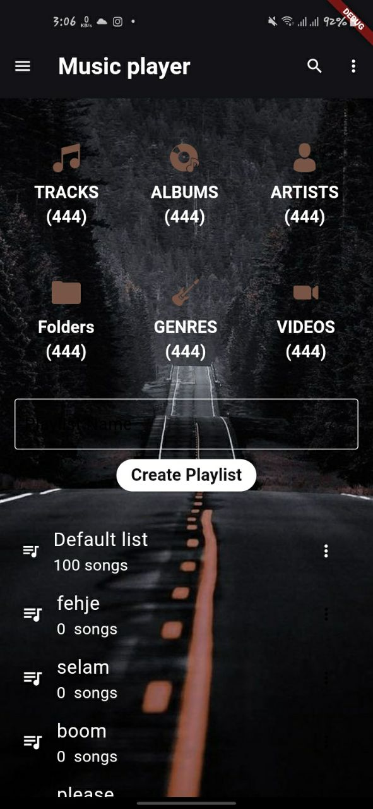
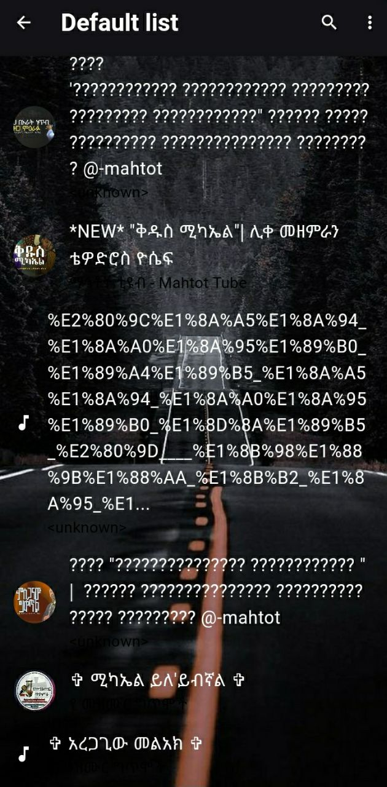
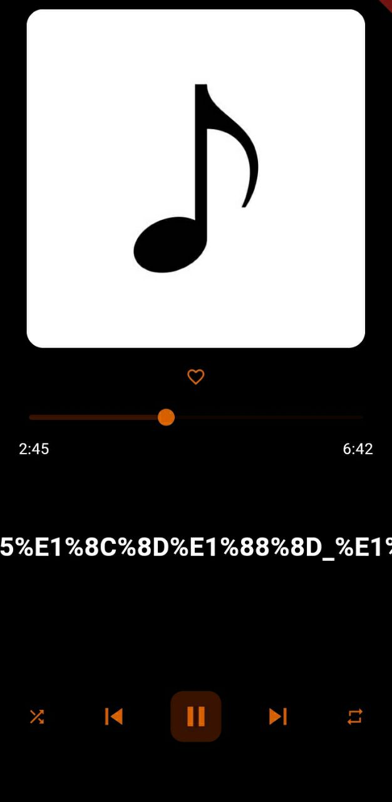

Here’s a professional and comprehensive `README.md` file tailored for your **Music Player App**:

---

# 🎵 Music Player App

A sleek, feature-rich music player app built with Flutter, designed to enhance your music listening experience.

---

## 📱 Features

- 🎶 **Play Local Music**: Automatically detects and plays songs stored on your device.
- 🔀 **Shuffle & Repeat**: Enjoy songs in random order or loop your favorites.
- 📂 **Create and Manage Playlists**: Organize your music into personalized playlists.
- 🌟 **Custom Themes**: The app adapts to your preferred theme based on the selected album art.
- 📈 **Music Visualization**: Stunning audio waveforms and animations for a dynamic playback experience.
- 🛠️ **Background Playback**: Continue listening while using other apps.

---

## 🚀 Getting Started

### Prerequisites

- Flutter SDK installed ([Get Flutter](https://flutter.dev/docs/get-started/install)).
- Compatible Android or iOS emulator/device.

### Installation

1. Clone this repository:

   git clone https://github.com/your-username/music-player-app.git

2. Navigate to the project directory:

   cd music-player-app

3. Install dependencies:

   flutter pub get

4. Run the app:

   flutter run

---

## 🖌️ App Preview

## 📸 Screenshots

**Home Screen**  

**Playlist Page**  

**Player Page**  

**Theme Page**  

---

## 🛠️ Technologies Used

- **Flutter**: Frontend framework for building cross-platform apps.
- **audioplayers**: For seamless music playback.
- **on_audio_query**: To access and manage local music files.
- **sqflite**: For offline playlist and app data storage.
- **audio_waveforms**: For real-time audio visualization.

---

## 📚 Documentation

### App Structure

- `lib/`
  - `screens/`: Contains all app screens (e.g., Home, Player, Playlist).
  - `widgets/`: Reusable UI components.
  - `providers/`: State management classes for themes, playlists, and playback.
  - `services/`: Handles music file fetching and database integration.

### Key Files

- `main.dart`: Entry point of the app.
- `theme_provider.dart`: Manages dynamic themes based on album art.
- `music_player.dart`: Handles music playback logic.

---

## 🌟 Contributing

Contributions are welcome! Follow these steps:

1. Fork the repository.
2. Create a feature branch:

   git checkout -b feature/your-feature

3. Commit your changes:

   git commit -m "Add your feature"

4. Push your branch:

   git push origin feature/your-feature

5. Open a pull request.

---

## 📧 Contact

For any queries or feedback:  
**Name:** Your Name  
**Email:** your-email@example.com  
**GitHub:** [Your GitHub Profile](https://github.com/your-username)

---

